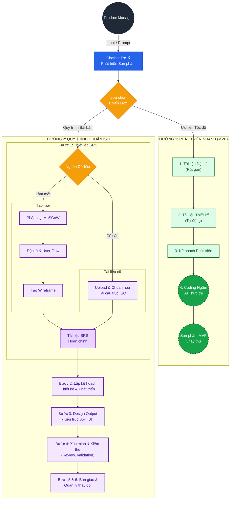

```mermaid
graph TD

    %% ====== 1. STYLE DEFINITIONS ======
    classDef actor fill:#1f2937,stroke:#fff,stroke-width:2px,color:#fff;
    classDef system fill:#2563eb,stroke:#1d4ed8,stroke-width:2px,color:#fff;
    classDef decision fill:#f59e0b,stroke:#d97706,stroke-width:2px,color:#fff,shape:rhombus;
    
    %% Style MVP
    classDef fastTrack fill:#dcfce7,stroke:#166534,stroke-width:2px,color:#166534;
    classDef aiHidden fill:#16a34a,stroke:#14532d,stroke-width:2px,color:#fff,stroke-dasharray: 5 5;
    
    %% Style ISO
    classDef isoStep fill:#f3e8ff,stroke:#6b21a8,stroke-width:2px,color:#4c1d95;
    classDef isoDoc fill:#e9d5ff,stroke:#7e22ce,stroke-width:2px,color:#4c1d95;
    
    %% ====== 2. NODES ======
    PM((Product Manager)):::actor
    Chatbot["Chatbot Trợ lý<br/>Phát triển Sản phẩm"]:::system
    ChooseStrategy{"Lựa chọn<br/>Chiến lược"}:::decision
    
    %% ====== 3. MAIN FLOW ======
    PM -->|"Input / Prompt"| Chatbot
    Chatbot --> ChooseStrategy

    %% ==========================================================
    %% BRANCH 1: MVP
    %% ==========================================================
    subgraph MVP_Flow ["HƯỚNG 1: PHÁT TRIỂN NHANH (MVP)"]
        direction TB
        Spec["1. Tài liệu Đặc tả<br/>(Rút gọn)"]:::fastTrack
        Design["2. Tài liệu Thiết kế<br/>(Tự động)"]:::fastTrack
        Plan["3. Kế hoạch Phát triển"]:::fastTrack
        Coding(("4. Coding Ngầm<br/>AI Thực thi")):::aiHidden
        MVP_Result(("Sản phẩm MVP<br/>Chạy thử")):::aiHidden
        
        Spec --> Design --> Plan --> Coding --> MVP_Result
    end

    %% ==========================================================
    %% BRANCH 2: ISO
    %% ==========================================================
    subgraph ISO_Flow ["HƯỚNG 2: QUY TRÌNH CHUẨN ISO"]
        direction TB
        
        %% --- BƯỚC 1 ---
        subgraph Step1_Area ["Bước 1: Thiết lập SRS"]
            direction TB
            ISO_Source{"Nguồn Dữ liệu"}:::decision
            
            subgraph New_Doc ["Tạo mới"]
                MoSCoW["Phân loại MoSCoW"]:::isoStep
                Detail["Đặc tả & User Flow"]:::isoStep
                Wireframe["Tạo Wireframe"]:::isoStep
            end
            
            subgraph Exist_Doc ["Tài liệu cũ"]
                Refactor["Upload & Chuẩn hóa<br/>Tái cấu trúc ISO"]:::isoStep
            end
            
            %% ĐÃ SỬA LẠI DÒNG NÀY: Dùng ngoặc vuông [] thay vì hình đặc biệt để tránh lỗi
            SRS_Doc["Tài liệu SRS<br/>Hoàn chỉnh"]:::isoDoc
        end

        %% --- BƯỚC 2 -> 6 ---
        Step2["Bước 2: Lập kế hoạch<br/>Thiết kế & Phát triển"]:::isoStep
        Step3["Bước 3: Design Output<br/>(Kiến trúc, API, UI)"]:::isoStep
        Step4["Bước 4: Xác minh & Kiểm thử<br/>(Review, Validation)"]:::isoStep
        Step5["Bước 5 & 6: Bàn giao &<br/>Quản lý thay đổi"]:::isoStep

        %% Luồng đi ISO
        ISO_Source -->|"Làm mới"| MoSCoW
        MoSCoW --> Detail --> Wireframe
        
        ISO_Source -->|"Có sẵn"| Refactor
        
        Wireframe --> SRS_Doc
        Refactor --> SRS_Doc
        
        SRS_Doc --> Step2
        Step2 --> Step3
        Step3 --> Step4
        Step4 --> Step5
    end

    %% ====== 4. CONNECT ======
    ChooseStrategy -->|"Ưu tiên Tốc độ"| Spec
    ChooseStrategy -->|"Quy trình Bài bản"| ISO_Source
```
