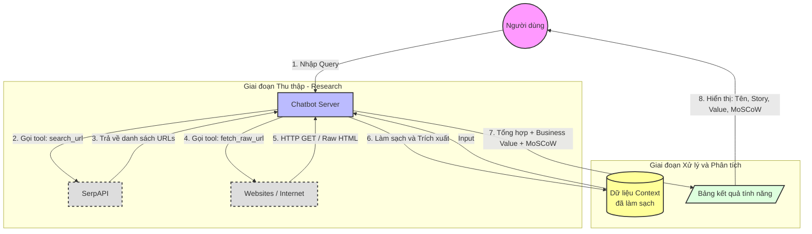

```mermaid
graph TD

    %% ====== STYLE DEFINITIONS ======
    classDef actor fill:#f9f,stroke:#333,stroke-width:2px;
    classDef system fill:#bbf,stroke:#333,stroke-width:2px;
    classDef external fill:#ddd,stroke:#333,stroke-width:2px,stroke-dasharray:5 5;
    classDef process fill:#dfd,stroke:#333,stroke-width:2px;
    classDef data fill:#ff9,stroke:#333,stroke-width:2px;

    %% ====== NODES ======
    User((Người dùng)):::actor
    Server[Chatbot Server]:::system
    Serp[SerpAPI]:::external
    Web[Websites / Internet]:::external
    Context[(Dữ liệu Context<br/>đã làm sạch)]:::data
    Result[/Bảng kết quả tính năng/]:::process

    %% ====== MAIN FLOW ======
    User -->|1. Nhập Query| Server

    %% ====== PHASE 1 ======
    subgraph Phase1 ["Giai đoạn Thu thập - Research"]
        direction TB
        Server -->|2. Gọi tool: search_url| Serp
        Serp -->|3. Trả về danh sách URLs| Server
        Server -->|4. Gọi tool: fetch_raw_url| Web
        Web -->|5. HTTP GET / Raw HTML| Server
    end

    %% ====== PHASE 2 ======
    subgraph Phase2 ["Giai đoạn Xử lý và Phân tích"]
        direction TB
        Server -->|6. Làm sạch và Trích xuất| Context
        Context -->|Input| Server
        Server -->|7. Tổng hợp + Business Value + MoSCoW| Result
    end

    %% ====== OUTPUT ======
    Result -->|8. Hiển thị: Tên, Story, Value, MoSCoW| User
```
